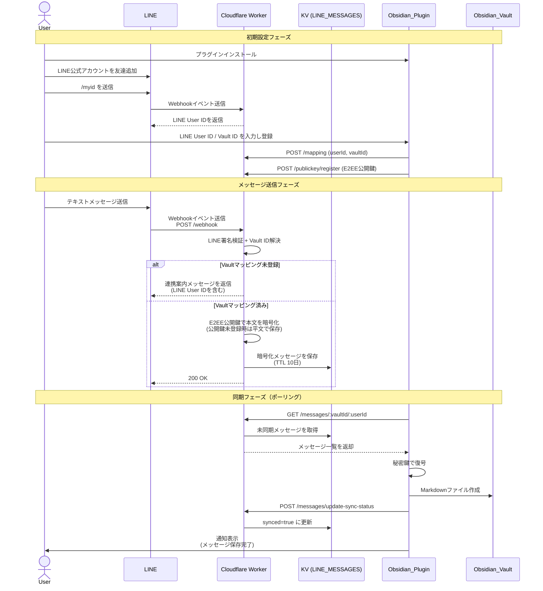
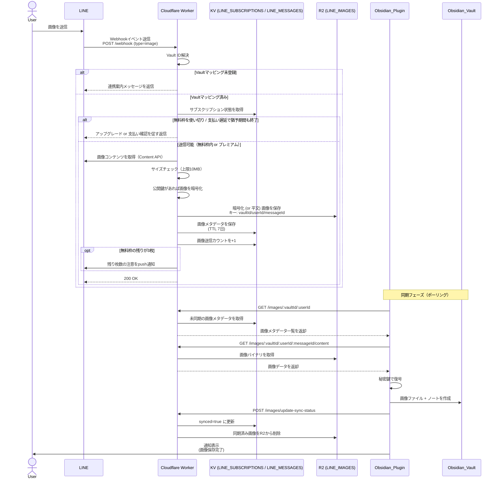
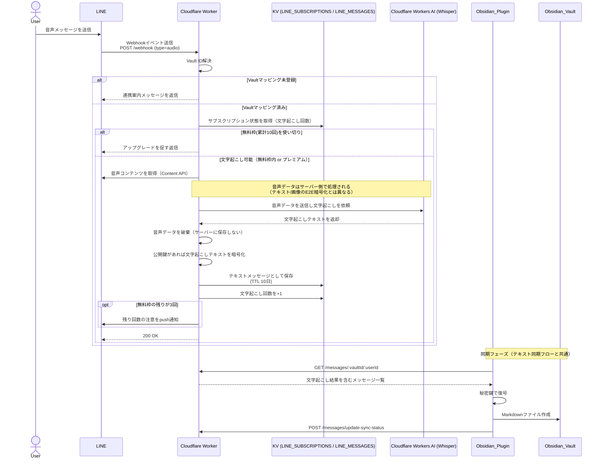
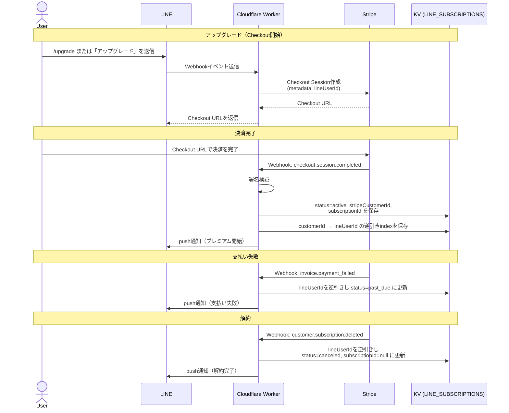

# LINE to Obsidian シーケンス図

このドキュメントでは、LINEメッセージ（テキスト・画像・音声）からObsidianへの保存までの流れ、および決済フローを説明します。バックエンドはCloudflare Workers + KV + R2で構成され、Obsidianプラグインは自動/手動同期のタイミングでWorkerにポーリング（GETリクエスト）してメッセージを取得します。

- テキストメッセージ同期フロー
- 画像送信フロー
- 音声文字起こしフロー
- Stripe決済フロー

## テキストメッセージ同期フロー

### フローの説明

#### 初期設定フェーズ
1. ユーザーがObsidianプラグインをインストール
2. LINE公式アカウントを友達追加し、`/myid` を送信してLINE User IDを取得
3. Obsidianプラグイン設定でLINE User ID / Vault IDを入力し「Register」を実行
   - `POST /mapping` でVault IDとLINE User IDの紐付けをKVに保存
   - `POST /publickey/register` でE2EE用のRSA公開鍵をWorkerに登録

#### メッセージ送信フェーズ
1. ユーザーがLINEでテキストメッセージを送信
2. LINEがWebhookイベントをCloudflare WorkerのPOST `/webhook` に送信
3. Workerが署名検証後、Vault IDマッピングを確認
   - 未登録の場合：連携案内とLINE User IDを返信
   - 登録済みの場合：公開鍵があればAES-GCM+RSA-OAEPで本文を暗号化し、KV（`LINE_MESSAGES`、TTL 10日）に保存

#### 同期フェーズ（ポーリング）
1. Obsidianプラグインが手動 or 自動同期タイミングで `GET /messages/:vaultId/:userId` を実行
2. Workerが未同期メッセージをKVから取得して返却
3. プラグインが秘密鍵で復号し、Markdownファイルを作成
4. `POST /messages/update-sync-status` で同期済みフラグを更新
5. プラグインがユーザーに完了通知を表示

## 画像送信フロー

### フローの説明
1. ユーザーがLINEで画像を送信すると、WorkerがVault IDマッピングとサブスクリプション状態（`LINE_SUBSCRIPTIONS`）を確認する
2. 無料プランは累計10枚まで送信可能。枠を使い切った場合や支払いに問題がある場合はアップグレード・支払い確認を促す返信を行い、画像は保存しない
3. 送信可能な場合、LINE Content APIから画像を取得し10MB以内かチェックした上で、E2EE公開鍵が登録済みならAES-GCMで暗号化してR2（`LINE_IMAGES`）に保存し、メタデータをKVに保存する（TTL 7日）
4. 無料プランの残り枚数が3枚になった時点でpush通知を送る
5. Obsidianプラグインは同期タイミングで画像メタデータと画像本体を取得し、復号してVaultに画像ファイルとノートを作成する
6. 同期完了をWorkerに通知すると、Workerは対象画像をR2から削除する。同期されないまま7日経過した画像はTTLにより自動的に期限切れとなる

## 音声文字起こしフロー

### フローの説明
1. ユーザーがLINEで音声メッセージを送信すると、Workerがサブスクリプション状態（文字起こし回数）を確認する
2. 無料プランは累計10回まで。枠を使い切った場合はアップグレードを促す返信のみ行う
3. 文字起こし可能な場合、LINE Content APIから音声データを取得し、**Cloudflare Workers AI（Whisper）にサーバー側で送信して文字起こしを行う**。これはテキスト・画像がE2E暗号化されるのに対し、音声は処理の性質上サーバー側で内容を扱う点で異なる
4. 音声ファイル自体はサーバーに保存されず、文字起こし後に破棄される
5. 文字起こし結果のテキストは、通常のテキストメッセージと同じE2E暗号化を適用してKVに保存される（TTL 10日）
6. 無料プランの残り回数が3回になった時点でpush通知を送る
7. Obsidianプラグインへの同期はテキストメッセージ同期フローと同じ経路（`GET /messages/:vaultId/:userId` によるポーリング）で行われる

## Stripe決済フロー

### フローの説明
1. ユーザーがLINEで `/upgrade` または「アップグレード」を送信すると、WorkerがStripe Checkout Sessionを作成し、LINE User IDをmetadataに紐付ける
2. WorkerはStripeから受け取ったCheckout URLをLINEに直接返信する
3. ユーザーがCheckout URLで決済を完了すると、Stripeが `checkout.session.completed` WebhookをWorkerに送信する
4. Workerは署名を検証し、KV（`LINE_SUBSCRIPTIONS`）のプラン状態を `active` に更新し、Stripe顧客IDからLINE User IDを引けるよう逆引きindexを保存する
5. 決済完了・支払い失敗（`invoice.payment_failed` → `past_due`）・解約（`customer.subscription.deleted` → `canceled`）のいずれの場合も、対応するLINEユーザーへpush通知が送られる

## 重要なポイント
- すべてのメッセージ・画像はVault IDによって適切なObsidian Vaultに振り分けられる
- Obsidianプラグインは常にWorkerへポーリング（GETリクエスト）してメッセージ/画像を取得する。Worker側からプラグインへ直接プッシュすることはない
- メッセージ・画像の保存は非同期で行われ、エラーが発生してもLINE Webhookには適切なレスポンスが返される
- テキストと画像はE2E暗号化されサーバーは復号できないが、音声文字起こしは処理の性質上サーバー側（Cloudflare Workers AI）で音声を扱う。文字起こし結果のテキストはテキストメッセージと同じ暗号化で保存される
- 画像は同期完了時にR2から削除され、未同期でも7日でTTL失効する。テキスト（文字起こし結果含む）はKV上で10日後にTTL失効する
- 無料プランの画像送信・音声文字起こしはそれぞれ累計10回までで、プレミアムプラン（月額300円）は両方が無制限になる
- Stripe決済イベント（完了・失敗・解約）はLINEへのpush通知でユーザーに伝えられる
